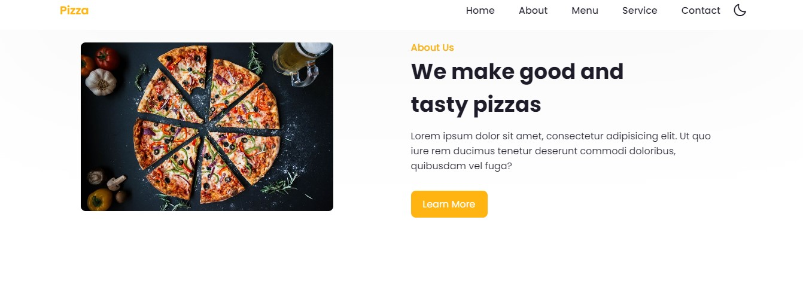
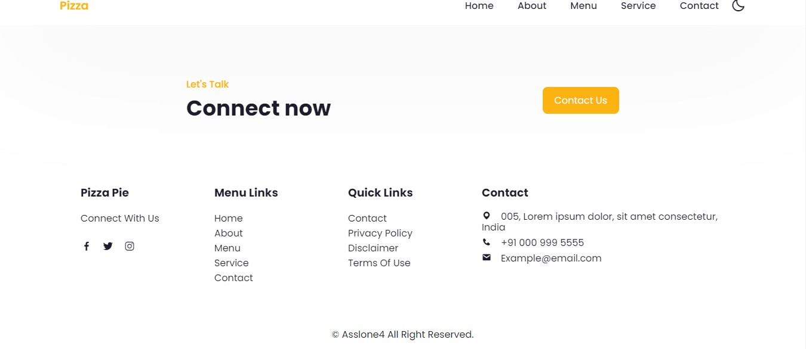

# 🍕 Pizza Website

Welcome to the Pizza Website repository! This comprehensive project offers an immersive online pizza ordering experience, showcasing a wide variety of pizzas and utilizing a stack of technologies including  HTML, CSS, JavaScript

### Pizza

## Features-
- Dark mode: Changing Mode Togggle button Dark mode and Light Mode

- User-friendly interface: The project features a clean and intuitive user interface that makes it easy to navigate and search for content. The design is also responsive, adapting to different screen sizes and devices.

- Responsive design: The project is designed to be responsive, ensuring that the user interface is optimized for all screen sizes and devices. This includes desktops, laptops, tablets, and smartphones.

- Front-end development: The project showcases skills in front-end development, specifically using HTML, CSS, and JavaScript to create the user interface, implement interactivity, and fetch data from APIs.

- Project management: The project was developed using a version control system (Git) and follows best practices for code organization and documentation.

### Explore Our Menu 🍽️

Dive into an enticing selection of pizzas, ranging from timeless classics like Margherita to inventive specialties that cater to a variety of taste preferences. Our menu reflects our dedication to quality, featuring handpicked ingredients that come together to create mouthwatering flavor profiles.

## Screenshots & Explanations

1. **About Us** 

   Get to know us better! Learn about the passion and dedication behind our pizzas.

2. **Home Page / Landing Page** 

   Our inviting landing page welcomes you to explore our menu and order with ease.

3. **Our Menu** !

4 **Contact Us** 

   Reach out to us effortlessly for any inquiries or assistance.

## Technologies Used

 

## Video Preview
[![Video Title]https://youtu.be/4xh7DDcJ0bQ]

